# 🌍 AirWise: Smart Cities Air Quality Management with Pollution Passport

## 📖 Overview

AirWise is a comprehensive air quality monitoring and management platform designed for smart cities, with a focus on Gurugram, Haryana. The application combines real-time pollution tracking, AI-powered predictions, and an innovative **Pollution Passport** system that gamifies environmental responsibility through personalized scoring and real-world rewards.

## 🚀 Novel Concepts & Innovation

### 🎫 **Pollution Passport** - World's First Personalized Air Quality Credit System
The Pollution Passport is a revolutionary concept that transforms environmental consciousness into tangible benefits:

- **Real-Time Pollution Credit Scoring**: Dynamic scoring algorithm (0-100) based on:
  - AQI Exposure (40% weight) - Real-time tracking using OpenWeatherMap API
  - Transport Mode (25% weight) - GPS-based eco-friendly transport analysis
  - Green Zone Time (20% weight) - Geofencing for parks and clean areas
  - Behavior Pattern (15% weight) - AI-analyzed pollution-conscious choices

- **Real-World Incentives**: Direct integration with:
  - Insurance companies (up to 10% premium discounts)
  - Banks (reduced interest rates for green loans)
  - Government schemes (certificates and recognition)
  - Transport systems (free metro cards, fuel discounts)
  - Retail partners (air purifiers, organic food discounts)

- **Gamification Features**:
  - Multi-tier leaderboards (Individual, Society, Corporate)
  - Achievement badges and streak tracking
  - QR code-based reward redemption system
  - Environmental impact metrics (CO₂ saved, money saved, trees equivalent)

### 🧠 **AI-Powered Prediction Engine**
- **Micro-zone Forecasting**: Block-level (500m x 500m) pollution predictions
- **Multi-source Data Fusion**: Combines satellite data, IoT sensors, weather APIs
- **Temporal Analysis**: LSTM/GRU models for time-series forecasting
- **Anomaly Detection**: Real-time identification of pollution spikes

### 🗺️ **Geospatial Intelligence**
- **Real-time Pollution Hotspots**: Interactive maps with risk-level color coding
- **Google Air View+ Integration**: Street-level pollution visualization
- **GDI Interface**: Government geospatial data sharing
- **Dynamic Heat Maps**: Live pollution concentration overlays

## 🏗️ System Architecture

```mermaid
graph TB
    subgraph "Client Layer"
        A[🌐 Frontend<br/>React + TypeScript<br/>📱 Pollution Passport UI<br/>🗺️ Interactive Maps<br/>🏆 Leaderboards]
    end
    
    subgraph "Application Layer"
        B[⚙️ Backend<br/>Flask API<br/>🧠 ML Models<br/>📊 Scoring Algorithm<br/>📈 Data Pipeline<br/>🎁 Reward System<br/>🔌 REST APIs]
    end
    
    subgraph "Data Layer"
        C[🌤️ OpenWeatherMap<br/>Weather Data]
        D[🌬️ Google Air Quality<br/>Air Pollution Data]
        E[🌍 GDI Interface<br/>Geographic Data]
        F[📡 IoT Sensors<br/>Real-time Monitoring]
        G[🛰️ Satellite Data<br/>Environmental Imagery]
    end
    
    A -.->|HTTP Requests| B
    B -.->|API Calls| C
    B -.->|API Calls| D
    B -.->|API Calls| E
    B -.->|Data Collection| F
    B -.->|Data Ingestion| G
    
    classDef frontend fill:#e1f5fe,stroke:#0288d1,stroke-width:2px
    classDef backend fill:#f3e5f5,stroke:#7b1fa2,stroke-width:2px
    classDef external fill:#e8f5e8,stroke:#388e3c,stroke-width:2px
    
    class A frontend
    class B backend
    class C,D,E,F,G external
```



## 🌟 Core Features

### 📊 **Air Quality Monitoring**
- Real-time AQI tracking with 5-minute refresh intervals
- Historical data analysis and trend visualization
- Weather integration (wind, humidity, temperature)
- Multiple pollutant tracking (PM2.5, PM10, NO₂, SO₂, O₃, CO)

### 🎯 **Pollution Passport System**
- Personalized scoring algorithm with transparent methodology
- Real-time transport mode tracking and carbon footprint analysis
- Green zone check-ins with geofencing technology
- Behavioral pattern analysis using machine learning
- Comprehensive reward catalog across 8+ categories

### 🏆 **Gamification & Social Features**
- Individual, Society, and Corporate leaderboards
- Weekly/Monthly ranking systems with trend tracking
- Achievement badges and milestone celebrations
- Social sharing and friend invitation system
- Environmental impact visualization

### 📱 **Interactive Dashboard**
- Full-screen pollution maps with real-time hotspots
- Score breakdown with progress tracking
- Quick action buttons for logging activities
- Notification system for alerts and achievements
- Mobile-responsive design with PWA support

### 🎁 **Reward Ecosystem**
- **Insurance**: Health insurance discounts (up to ₹12,000 savings)
- **Financial**: Green vehicle loan rate reductions (₹50,000+ savings)
- **Transport**: Free metro cards and fuel discounts
- **Government**: Official recognition certificates
- **Health**: Free medical checkups and consultations
- **Utility**: Electricity bill discounts
- **Retail**: Air purifiers, organic food discounts

### 🔮 **Predictive Analytics**
- 24-48 hour pollution forecasting
- Infrastructure impact analysis
- Policy recommendation engine
- Anomaly detection and early warning systems

## 📡 Data Sources & Integration

- **OpenWeatherMap API**: Real-time weather and basic pollution data
- **Google Air View+**: Street-level pollution measurements
- **GDI (Geospatial Data Interface)**: Government spatial datasets
- **IoT Sensors**: Local air quality monitoring stations
- **Satellite Data**: NOAA/Copernicus pollution imagery
- **GPS Tracking**: Simulated transport mode detection
- **Geofencing**: Park and clean zone identification

## 💻 Technology Stack

| Component | Technologies |
|-----------|-------------|
| **Frontend** | React 18, TypeScript, Vite, TailwindCSS |
| **Mapping** | React-Leaflet, OpenStreetMap, Geospatial APIs |
| **Backend** | Flask, Python 3.9+, SQLAlchemy |
| **Database** | PostgreSQL with PostGIS extensions |
| **ML/AI** | Scikit-learn, TensorFlow, Prophet, NumPy |
| **APIs** | REST APIs, CORS enabled, JSON responses |
| **Deployment** | Docker, Vercel (Frontend), GCP/AWS (Backend) |
| **Authentication** | JWT tokens, bcrypt password hashing |

## 🚀 Setup & Installation

### Prerequisites
- **Node.js** (v18 or higher)
- **Python** (v3.9 or higher)
- **npm** or **yarn**
- **Git**

### 📁 Project Structure
```
SDG_EL-main/
├── SDGFInal/                 # Main application directory
│   ├── src/                  # Frontend source code
│   │   ├── components/       # Reusable React components
│   │   ├── pages/           # Page components
│   │   ├── services/        # API service layer
│   │   └── styles/          # CSS and styling
│   ├── backend/             # Backend API server
│   │   ├── app.py          # Main Flask application
│   │   ├── models/         # ML models and data processing
│   │   └── requirements.txt # Python dependencies
│   ├── package.json        # Frontend dependencies
│   └── vite.config.ts      # Vite configuration
├── DataAndML/              # Machine learning datasets
└── README.md              # This file
```

### 🔧 Installation Steps

#### 1. Clone the Repository
```bash
git clone <repository-url>
cd SDG_EL-main/SDGFInal
```

#### 2. Frontend Setup
```bash
# Install frontend dependencies
npm install

# Start the development server
npm run dev
```
The frontend will be available at `http://localhost:5173`

#### 3. Backend Setup
```bash
# Navigate to backend directory
cd backend

# Create and activate virtual environment (recommended)
python3 -m venv venv
source venv/bin/activate  # On Windows: venv\Scripts\activate

# Install Python dependencies
pip install -r requirements.txt

# Start the Flask server
python3 app.py
```
The backend API will be available at `http://localhost:5000`

#### 4. Environment Configuration
Create a `.env` file in the backend directory:
```env
OPENWEATHER_API_KEY=your_openweathermap_api_key
FLASK_ENV=development
DATABASE_URL=your_database_url
SECRET_KEY=your_secret_key
```

### 🌐 API Endpoints

#### Core Air Quality APIs
- `GET /api/current` - Current air quality data
- `GET /api/hourly-trend` - Hourly AQI trends
- `GET /api/geospatial` - Geospatial pollution data
- `GET /api/alerts` - Pollution alerts and notifications

#### Pollution Passport APIs
- `GET /api/score/get?user_id={id}` - Get pollution credit score
- `GET /api/geo/hotspots` - Real-time pollution hotspots
- `POST /api/rewards/apply` - Apply for rewards
- `GET /api/leaderboard/fetch` - Fetch leaderboard data
- `GET /api/rewards/available` - Available rewards catalog

## 🎮 Usage Guide

### Getting Started with Pollution Passport

1. **Navigate to Pollution Passport**: Click on the "🌱 Pollution Passport" in the main navigation
2. **View Your Score**: See your current pollution credit score (0-100) with category rating
3. **Understand the Algorithm**: Click the info button to see how scores are calculated
4. **Explore the Map**: Interactive pollution map shows real-time hotspots and AQI levels
5. **Claim Rewards**: Browse available rewards and claim based on your score
6. **Log Activities**: Use quick actions to log transport modes and park visits
7. **Check Leaderboards**: Compare your performance with others in your category

### Quick Actions

#### 🚗 Log Transport
- Click "Log Transport" to record your daily commute
- Choose from Metro, Bus, Bicycle, Walking, or Private Car
- See immediate impact on your pollution score
- Track carbon footprint and savings

#### 🌳 Visit Parks
- Click "Visit Park" to see nearby green zones
- Get directions to parks with high clean air scores
- Check-in to earn green zone credits
- View available activities and amenities

### Reward System

1. **Check Eligibility**: Each reward has a minimum score requirement
2. **Claim Rewards**: Click "Claim" on eligible rewards
3. **Get QR Code**: Receive a unique QR code and 20-character coupon
4. **Redeem**: Present QR code or coupon to partner merchants

## 🏆 Key Metrics & Impact

### Performance Targets
- **Prediction Accuracy**: RMSE < 15 for 24-hour PM2.5 forecasts
- **Spatial Resolution**: 500m x 500m grid predictions
- **Response Time**: < 2 seconds for dashboard updates
- **Data Refresh**: 5-minute intervals for real-time data
- **User Engagement**: 70%+ daily active user retention

### Environmental Impact
- **CO₂ Tracking**: Calculate monthly CO₂ savings from user behavior
- **Money Saved**: Track financial benefits from eco-friendly choices
- **Tree Equivalent**: Convert CO₂ savings to tree planting equivalents
- **Clean Air Days**: Streak tracking for pollution-conscious behavior

## 🔮 Future Enhancements

### Planned Features
- **Mobile App**: Native iOS/Android applications
- **IoT Integration**: Direct sensor data streaming
- **AI Chatbot**: Personalized environmental advice
- **Corporate Dashboard**: Enterprise pollution tracking
- **Policy Simulator**: What-if analysis for city planners
- **Carbon Marketplace**: Trading of pollution credits

### Expansion Plans
- **Multi-city Deployment**: Delhi, Mumbai, Bangalore, Chennai
- **Regional Adaptation**: State-specific policies and incentives
- **International Markets**: Adaptation for global cities
- **Satellite Integration**: Real-time satellite pollution monitoring

## 👥 Team & Contributions

| Role | Responsibilities |
|------|-----------------|
| **AI/ML Engineer** | Pollution scoring algorithms, predictive models, anomaly detection |
| **Backend Engineer** | API development, data pipelines, reward system integration |
| **Frontend Engineer** | React dashboard, interactive maps, user experience design |
| **Data Scientist** | Data analysis, insights generation, algorithm optimization |
| **DevOps Engineer** | Deployment, scaling, monitoring, CI/CD pipelines |

## 📈 Success Metrics

### Technical KPIs
- 99.9% API uptime
- < 100ms average response time
- Real-time data accuracy > 95%
- Mobile responsiveness score > 90

### User Engagement KPIs
- Daily active users growth
- Reward redemption rate
- Social sharing frequency
- Score improvement trends

### Environmental KPIs
- Total CO₂ savings tracked
- User behavior change metrics
- Policy recommendation adoption
- Air quality awareness increase

---

**AirWise** - Transforming air quality awareness into environmental action through innovative technology and meaningful incentives. 🌱
